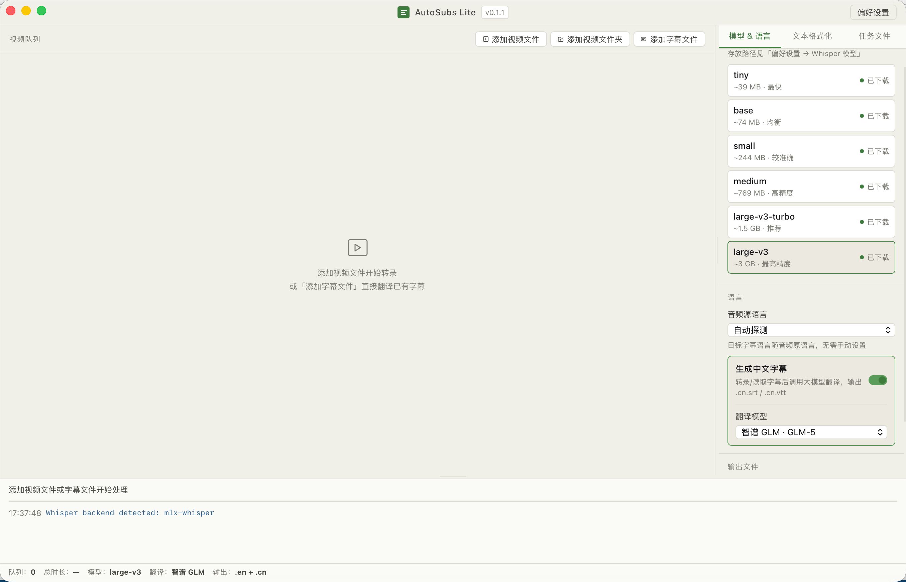

[English](README.md) | 中文

# AutoSubs Lite

批量视频字幕生成工具，基于 **Whisper 转录** + **大模型翻译**。支持批量处理视频、直接翻译已有字幕文件，输出与视频同目录的 `.en.srt` / `.zh-CN.srt` / `.zh-CN.vtt`。

- 💻 原生桌面应用（Tauri v2，支持 macOS / Windows）
- 🎙️ Whisper 本地转录（mlx-whisper（Apple Silicon）/ faster-whisper（Windows / Intel Mac））
- 🌐 LLM 翻译：DeepSeek / GLM / Kimi / OpenAI / Anthropic / MiniMax
- 📝 中文字幕按**中文语义**重新切分（不强制与英文 cue 一一对齐）
- 🔁 断点续传：任务文件自动保存，意外中断后再次打开即可继续

## 截图



---

## 一、安装部署

### 1.1 macOS

**系统要求**

| 项       | 要求                                                           |
| -------- | -------------------------------------------------------------- |
| 操作系统 | macOS 12+（Apple Silicon 最佳；Intel Mac 可用 faster-whisper） |
| Python   | 3.10 及以上                                                    |
| 硬盘     | ≥ 2 GB（含一个 Whisper 模型 + venv）                           |
| 内存     | ≥ 8 GB（运行 `large-v3` 建议 16 GB）                           |

**步骤 1：安装 DMG**

双击 `AutoSubs Lite_0.1.1_aarch64.dmg`，把 `AutoSubs Lite.app` 拖到 **Applications**。

**步骤 2：准备 Python 运行环境（⚠️ 必须）**

应用按以下优先级查找 Python（推荐路径加粗）：

1. 环境变量 `AUTOSUBS_PYTHON`
2. **`~/autosubs/venv/bin/python3`** ← 推荐
3. `/opt/homebrew/bin/python3` / `/usr/local/bin/python3` / `/usr/bin/python3`

```bash
# 确保有 Python 3.10+（若没有：brew install python@3.11）
python3 --version

# 创建专用 venv
mkdir -p ~/autosubs
python3 -m venv ~/autosubs/venv
source ~/autosubs/venv/bin/activate

# 安装依赖
pip install --upgrade pip
pip install mlx-whisper huggingface-hub          # Apple Silicon
# pip install faster-whisper huggingface-hub     # Intel Mac
```

**步骤 3：首次启动**

1. 打开 **AutoSubs Lite**，底部日志出现 `Whisper backend detected` 说明环境就绪
2. 点右上角 **偏好设置** → **Whisper 模型** → 下载模型
3. 点 **翻译模型** → 填入 LLM Provider 配置（详见 [LLM Provider 配置](#llm-provider-配置)）

---

### 1.2 Windows

**系统要求**

| 项       | 要求                                                                     |
| -------- | ------------------------------------------------------------------------ |
| 操作系统 | Windows 10 / 11（x64）                                                   |
| Python   | 3.10 及以上（需从 [python.org](https://www.python.org/downloads/) 安装） |
| WebView2 | 通常已随 Windows 11 / Edge 预装；Windows 10 若缺失安装程序会自动引导下载 |
| 硬盘     | ≥ 2 GB（含一个 Whisper 模型 + venv）                                     |
| 内存     | ≥ 8 GB                                                                   |

> mlx-whisper **仅支持 Apple Silicon**，Windows 必须用 `faster-whisper`。

**步骤 1：安装 Python**

在 [python.org](https://www.python.org/downloads/windows/) 下载 Python 3.11 安装包。
安装时 **勾选 "Add Python to PATH"**。

**步骤 2：安装应用**

从 GitHub Releases 下载 `AutoSubs.Lite_0.1.1_x64_en-US.msi`，双击安装。

**步骤 3：准备 Python 运行环境（⚠️ 必须）**

应用按以下优先级查找 Python：

1. 环境变量 `AUTOSUBS_PYTHON`
2. **`%USERPROFILE%\autosubs\venv\Scripts\python.exe`** ← 推荐
3. `%LOCALAPPDATA%\Programs\Python\Python3xx\python.exe`（安装时加了 PATH）
4. 系统 PATH 中的 `python.exe`

打开 **命令提示符（CMD）** 或 **PowerShell**：

```powershell
# 创建专用 venv（推荐路径）
mkdir "$env:USERPROFILE\autosubs"
python -m venv "$env:USERPROFILE\autosubs\venv"
& "$env:USERPROFILE\autosubs\venv\Scripts\Activate.ps1"

# 安装依赖
pip install --upgrade pip
pip install faster-whisper huggingface-hub
```

> PowerShell 执行策略报错时，先运行：
>
> ```powershell
> Set-ExecutionPolicy -ExecutionPolicy RemoteSigned -Scope CurrentUser
> ```

**步骤 4：首次启动**

同 macOS 步骤 3 — 打开应用，检查日志，下载 Whisper 模型，配置翻译模型。

---

### LLM Provider 配置

| Provider  | base_url                               | 推荐 model                |
| --------- | -------------------------------------- | ------------------------- |
| DeepSeek  | `https://api.deepseek.com/v1`          | `deepseek-chat`           |
| 智谱 GLM  | `https://open.bigmodel.cn/api/paas/v4` | `glm-4-flash`             |
| Kimi      | `https://api.moonshot.cn/v1`           | `moonshot-v1-8k`          |
| OpenAI    | `https://api.openai.com/v1`            | `gpt-4o-mini`             |
| Anthropic | `https://api.anthropic.com/v1`         | `claude-3-5-haiku-latest` |
| MiniMax   | `https://api.minimax.chat/v1`          | `abab6.5s-chat`           |

> Anthropic 使用 Messages API，代码中自动按 base_url 切换协议。

---

## 二、开发者快速开始

### macOS

```bash
git clone <repo>
cd autosubs-lite

npm install

python3 -m venv ~/autosubs/venv
source ~/autosubs/venv/bin/activate
pip install -r requirements.txt

# Rust（只需一次）
curl --proto '=https' --tlsv1.2 -sSf https://sh.rustup.rs | sh

npm run tauri dev        # 开发模式
npm run tauri build      # 打包（产物在 src-tauri/target/release/bundle/）
```

### Windows

```powershell
git clone <repo>
cd autosubs-lite

npm install

python -m venv "$env:USERPROFILE\autosubs\venv"
& "$env:USERPROFILE\autosubs\venv\Scripts\Activate.ps1"
pip install -r requirements.txt
# 把 requirements.txt 中的 mlx-whisper 换成：
pip install faster-whisper huggingface-hub

# Rust（只需一次，从 https://rustup.rs 下载安装）
# 安装完成后重开 PowerShell

npm run tauri dev        # 开发模式
npm run tauri build      # 打包（产物在 src-tauri\target\release\bundle\）
```

产物位置：

| 平台    | 产物                                                  |
| ------- | ----------------------------------------------------- |
| macOS   | `bundle/macos/AutoSubs Lite.app` / `bundle/dmg/*.dmg` |
| Windows | `bundle/msi/*.msi` / `bundle/nsis/*.exe`              |

### 自动化发版（GitHub Actions）

推送 `v*.*.*` 标签时，`.github/workflows/release.yml` 自动在 macOS 和 Windows runner 上构建并发布到 GitHub Releases：

```bash
./scripts/bump_version.sh 0.2.0   # 一键更新 5 处版本号
# 更新 CHANGELOG.md
npm run tauri build                # 本地验证
git add -A && git commit -m "chore: release v0.2.0"
git tag v0.2.0 && git push && git push --tags
# → GitHub Actions 自动构建 macOS DMG + Windows MSI 并上传到 Release
```

---

## 三、版本规范

格式：`MAJOR.MINOR.PATCH`

| 变更类型   | 改哪一位             | 示例              |
| ---------- | -------------------- | ----------------- |
| 新功能     | MINOR +1，PATCH 归 0 | 0.1.1 → **0.2.0** |
| Bug 修复   | PATCH +1             | 0.1.1 → **0.1.2** |
| 破坏性变更 | MAJOR +1             | 0.x.x → **1.0.0** |

一键改版本号：`./scripts/bump_version.sh X.Y.Z`（更新 5 处文件）。

---

## 四、使用说明

### 4.1 视频转字幕（最常见）

1. **添加视频** → 选文件或文件夹（递归扫描子文件夹）
2. 右侧选 Whisper 模型、源语言，按需勾选**生成中文字幕**
3. 点底部 **开始处理**
4. 完成后同目录生成 `{名}.{语言}.srt`，翻译后另生成 `{名}.zh-CN.srt`

### 4.2 直接翻译已有字幕（跳过 Whisper）

1. 点 **添加字幕文件** → 选文件夹（递归扫描 `.srt` / `.vtt`，跳过 `.zh-CN.*`）
2. **必须勾选** 生成中文字幕（否则开始按钮禁用）
3. 点 **开始处理**

输出命名：

| 输入         | 输出         |
| ------------ | ------------ |
| `foo.en.srt` | `foo.zh-CN.srt` |
| `foo.srt`    | `foo.zh-CN.srt` |
| `foo.en.vtt` | `foo.zh-CN.vtt` |
| `foo.vtt`    | `foo.zh-CN.vtt` |

### 4.3 断点续传

视频文件夹处理中断后，`.autosubs_task.json` 自动保存进度。再次选同一文件夹时点**续传进度**即可跳过已完成的视频。

### 4.4 偏好设置速查

| 选项             | 默认                | 说明                                     |
| ---------------- | ------------------- | ---------------------------------------- |
| Whisper 模型目录 | `~/autosubs/models` | 存放下载的模型                           |
| 翻译分批大小     | 80                  | 一次发给 LLM 的句数                      |
| 跳过已存在的 SRT | 开                  | 已有 `.en.srt` 则跳过转录                |
| 自动保存任务文件 | 开                  | 每条完成后写 `.autosubs_task.json`       |
| 重分段           | 开                  | Udemy 风格短 cue（45 字符目标，70 上限） |
| 代理             | 关                  | 支持 HTTP / SOCKS5 / 系统代理            |

---

## 五、项目结构

```
autosubs-lite/
├── python/                     # Python 处理引擎
│   ├── main.py                  # 主入口，stdin/stdout IPC
│   ├── transcriber.py           # Whisper 封装
│   ├── translator.py            # LLM 翻译 + 中文语义重切
│   ├── resegmenter.py           # Whisper 输出重切为短 cue
│   ├── srt_writer.py            # SRT/VTT 生成 + 文本格式化
│   ├── subtitle_reader.py       # 读 .srt / .vtt
│   └── task_file.py             # 任务文件 & 文件夹扫描
├── src/                         # 前端（React + TypeScript）
│   ├── App.tsx
│   ├── components/
│   ├── stores/appStore.ts
│   ├── i18n/locales.ts
│   └── styles/theme.css
├── src-tauri/                   # Rust 外壳
│   ├── src/lib.rs                # Python sidecar 管理（跨平台）
│   └── tauri.conf.json
├── .github/workflows/
│   └── release.yml              # macOS + Windows 自动构建发版
├── scripts/
│   ├── bump_version.sh          # 一键改版本号
│   └── setup.py                 # 依赖检查脚本
├── CHANGELOG.md
├── requirements.txt
└── package.json
```

---

## 六、常见问题

**Q1：macOS 启动提示 `找不到 python3`**
A：确认 `~/autosubs/venv/bin/python3` 存在。也可从终端指定：

```bash
AUTOSUBS_PYTHON=/path/to/python3 open -a "AutoSubs Lite"
```

**Q2：Windows 启动提示找不到 Python**
A：确认安装 Python 时勾选了 "Add to PATH"，或手动创建推荐 venv：

```powershell
python -m venv "$env:USERPROFILE\autosubs\venv"
```

**Q3：日志显示 `缺少 Whisper 后端`**
A：在 venv 里安装对应后端：

- macOS Apple Silicon：`pip install mlx-whisper`
- Windows / Intel Mac：`pip install faster-whisper`

**Q4：翻译失败 `N 句中 M 句未返回`**
A：LLM 响应被 `max_tokens` 截断，在**偏好设置 → 翻译分批**调小（建议 30–50）。

**Q5：Windows 安装时提示 "Windows 已保护你的电脑"**
A：点 **更多信息** → **仍要运行**。这是因为安装包暂未代码签名（普通个人工具的常见情况）。

**Q6：中文字幕条数比英文少**
A：预期行为 — v0.1.1 起按中文语义重切，英文 N 条 cue 翻译后可能合并为更少的中文 cue。

**Q7：代理配置了但 LLM 仍不通**
A：在**偏好设置 → 代理**点**测试代理**，确认 HTTP 204 返回后，再检查目标 base_url 是否需要走代理白名单。

---

## 七、许可证

MIT License — 详见 [LICENSE](LICENSE)
